# Java minigames (Tic Tac Toe and the Nim Game)

Play online at the famous Tic Tac Toe and Nim game with this Java software using the RMI interfaces for client and server communications.
* https://en.wikipedia.org/wiki/Tic-tac-toe
* https://en.wikipedia.org/wiki/Nim

## Tic Tac Toe:

A simple Tic Tac Toe online game working with Java RMI. You can play with your friends remotely.  
Work only with two players.

### Known issues 
* The game can't be restarted (next party will be bugged if you try it)
    - **Workaround:** close server and client then restart both.
* Sometime, when a player clicks to add a symbol and if it's his turn, it can happen that the symbol dosen't appear (but symbol appear for other player). However, server will have taken into account the symbol, it's only a displaying bug.
    - **Workaround:** You can add a symbol at your next turn, the last and currently symbol will appear.

### Author
Me (Adrien)

## Nim

https://en.wikipedia.org/wiki/Nim

The matches game (or Nim Game) is a minigame a where the goal is not to take the last remaining match.  
You can only play with a bot.

### Known issues
* The bot always win, even if you had to win (because the bot play even if game is ended, I need to fix that)

### Authors
Me (Adrien)
Sofiane Aiche

# Screenshots

**Serveur prêt - Server ready**

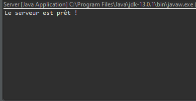

**Accueil - Home**

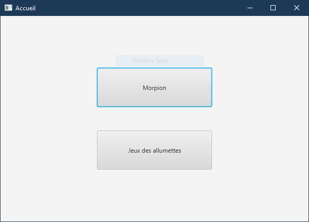

## Tic Tac Toe - Morpion

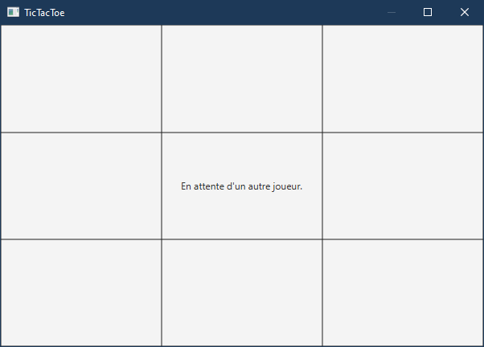
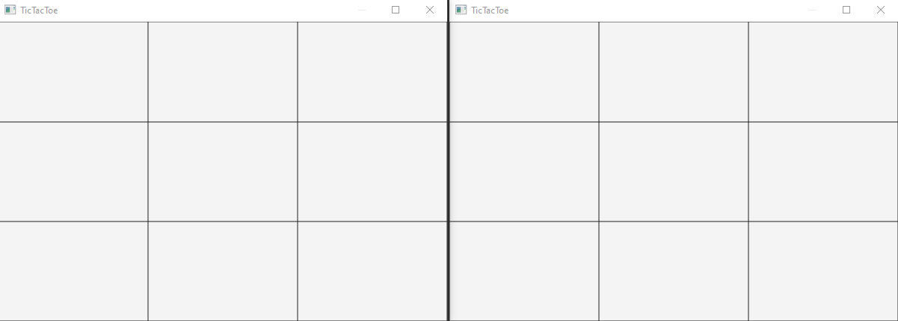
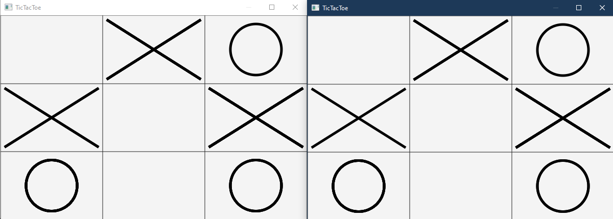
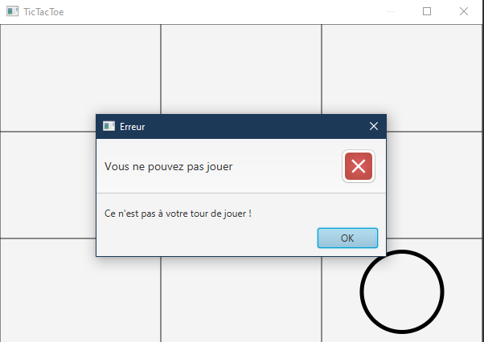
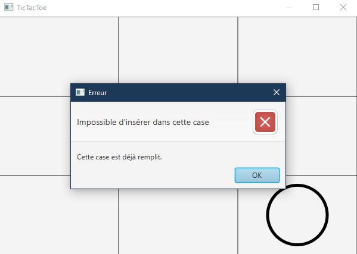
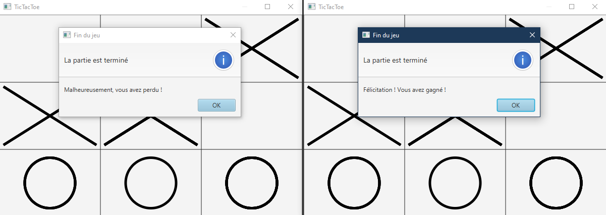

## Jeu des allumettes - Matches Game

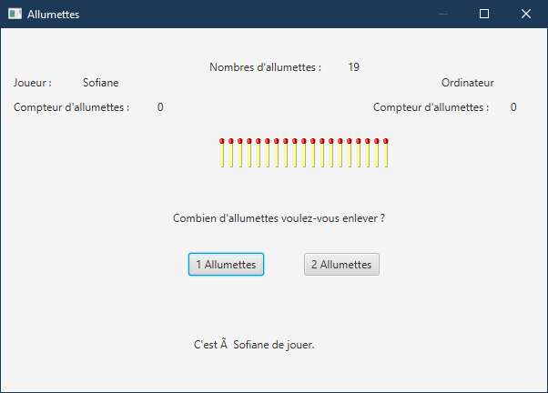
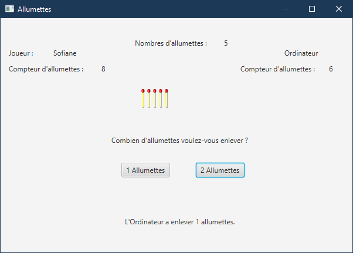
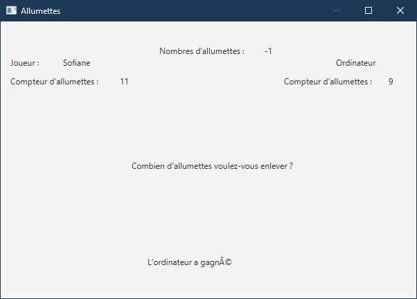
